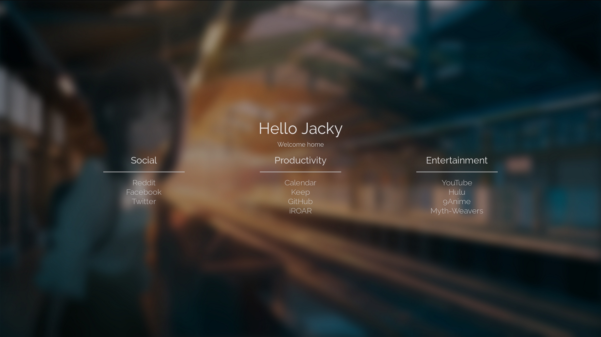
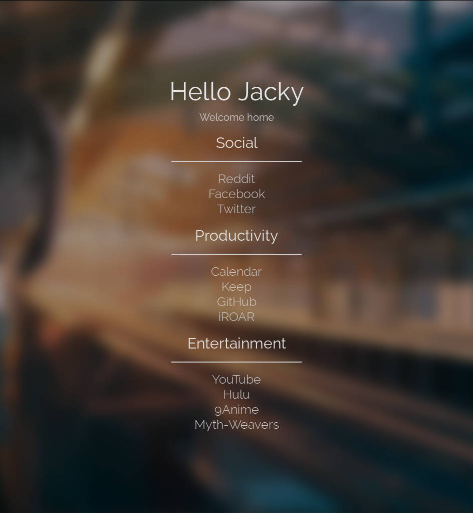

# [On hold]
I'm not presently using this startpage due to Firefox's inability to change the cursor focus upon 
opening a new tab with a third party extension, as well as poor performance in slow internet.

# startpage
Personal internet browser home and new tab page.

### Previews

    
    

Background image from 
[here](https://www.pixiv.net/member_illust.php?mode=medium&illust_id=74902740).
I took it into Photoshop and applied a Gaussian blur and darkened it.
